# AI Agent with Docker, LangGraph & Email

[English](README.md) | [Português](README.pt-BR.md)

[](https://www.python.org/)
[](https://fastapi.tiangolo.com/)
[](https://langchain-ai.github.io/langgraph/)
[](https://nextjs.org/)
[](https://docs.docker.com/compose/)
[](https://www.postgresql.org/)

A **LangGraph** email assistant: it reads the inbox, drafts mail, and sends only after you confirm. **FastAPI** (`api/`), a **Next.js** chat UI (`web/`), and **PostgreSQL**, orchestrated with **Docker Compose** and deployed on **DigitalOcean App Platform**.

[Overview](#overview) • [Features](#features) • [Architecture](#architecture) • [Walkthrough](#walkthrough) • [Getting started](#getting-started) • [API](#api) • [Deploy](#deploy) • [Project structure](#project-structure) • [Troubleshooting](#troubleshooting)

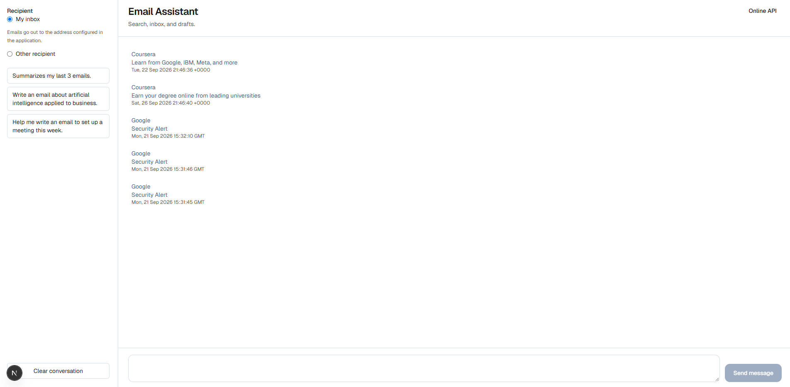

## Overview

The chat UI talks to a **LangGraph supervisor**. The supervisor routes each message to a specialist:

- **Research agent** — turns a request into a subject and a plain-text body.
- **Email agent** — reads the inbox over IMAP, summarizes messages, and prepares outbound mail.

Outbound mail is a **draft** on a review card. You can edit the subject, body, and recipient, then choose **Confirm send** or **Discard**. SMTP runs on confirm.

On an empty conversation the inbox sits in the center. The sidebar pins **My inbox** or **Other recipient**, and offers three example prompts. A reply to an open message uses that message's sender as the recipient. The pinned address applies to the next new draft.

## Features

- **Multi-agent supervisor** — routes research and email work with `langgraph-supervisor`.
- **Inbox** — recent messages in the center; opening one shows the sender, subject, date, and plain-text body, and clears the unread mark.
- **Draft, then send** — the assistant prepares the card; **Confirm send** delivers it through Gmail SMTP.
- **Reply** — **Reply** opens one draft whose subject starts with `Re:` and whose recipient is the sender.
- **Revise in place** — a follow-up in the composer updates that same card.
- **Summaries** — recent mail, with sender and subject, from the example prompt.
- **Persistence** — chat messages stored in PostgreSQL with SQLModel.
- **Docker Compose** — api, web, and database, with reload while you develop.
- **Production deploy** — DigitalOcean App Platform (api, web, and managed Postgres).

## Architecture

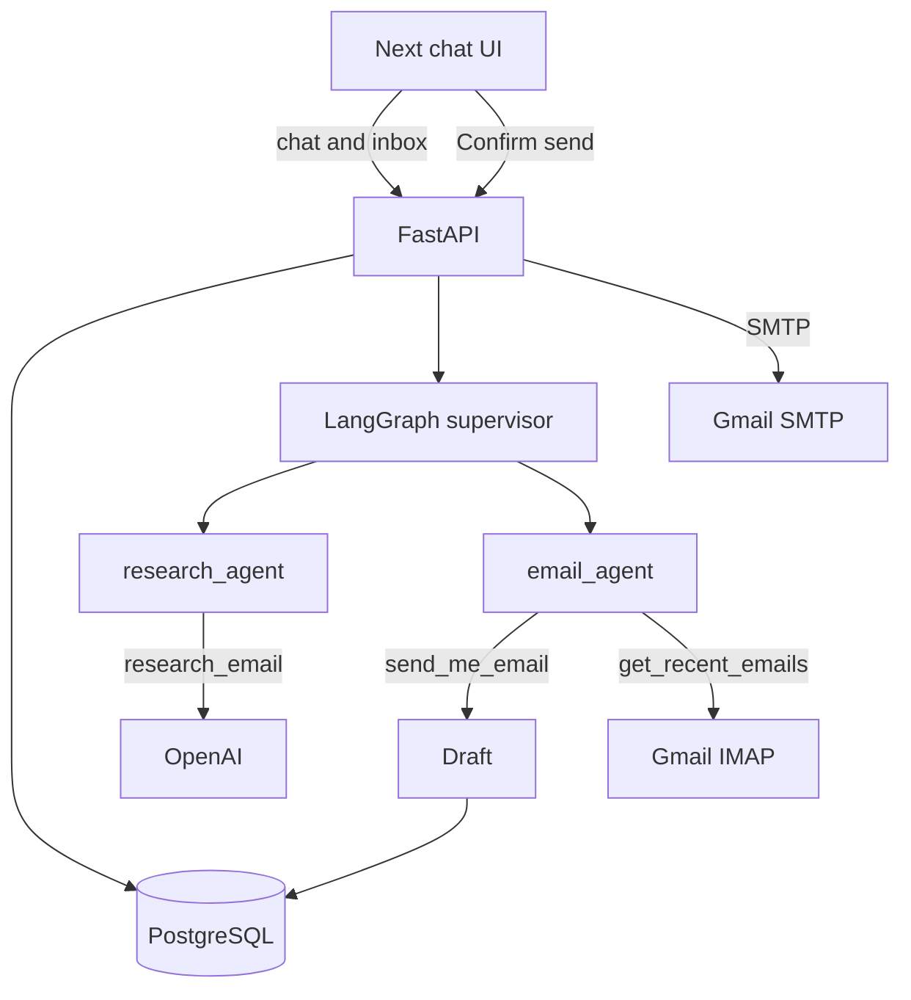

| Layer | Technology | Responsibility |
|-------|------------|----------------|
| API | FastAPI, uvicorn | HTTP, validation, persistence |
| Agents | LangGraph, langgraph-supervisor | Supervisor, research, and email |
| LLM | langchain-openai | Subject and plain-text body |
| Email | smtplib, IMAP | Send on confirm, read via Gmail |
| Database | SQLModel, PostgreSQL | Messages and drafts |
| UI | Next.js | Inbox, chat, review card, prompts |
| Containers | Docker Compose | Local stack and the production base |

## Walkthrough

### Home

Open the page with an empty conversation. The message list is in the center. The sidebar shows **My inbox** and three example prompts. That screen is the cover above.

### Open an email

Choose an unread item (the blue dot). The screen shows the sender, subject, date, and plain-text body, with **Back** and **Reply**. The dot is gone once the body is open.

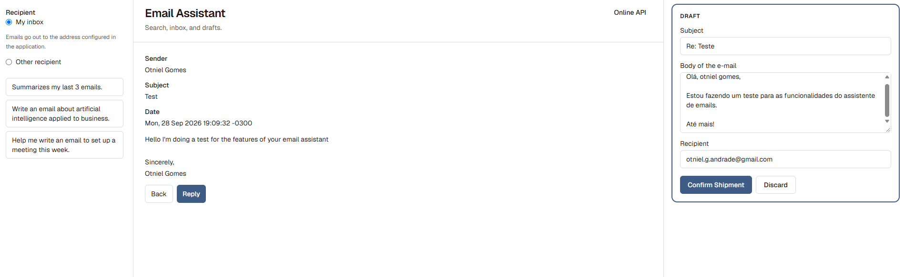

### Reply

Choose **Reply**. The **Draft** card opens with a subject that starts with `Re:`, a greeting, and the sender as the recipient. The address pinned in the sidebar stays out of this reply.

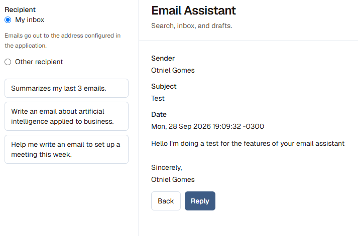

### Draft from the chat

Discard the previous draft, or clear the conversation. Use the prompt *Write an email about artificial intelligence applied to business.* The card comes back with a subject, a body that opens with `Hello,` and closes with a sign-off, and the buttons **Confirm send** and **Discard**.

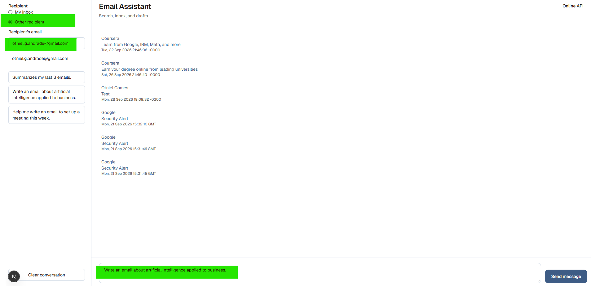

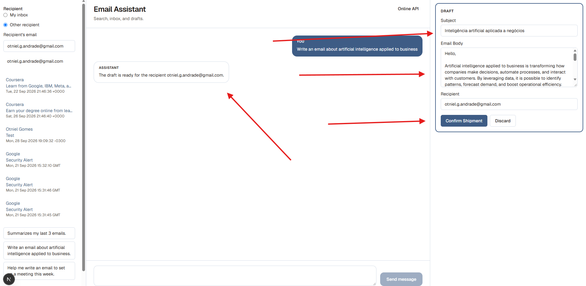

**Confirm send** delivers that card. The same thread then shows it as sent.

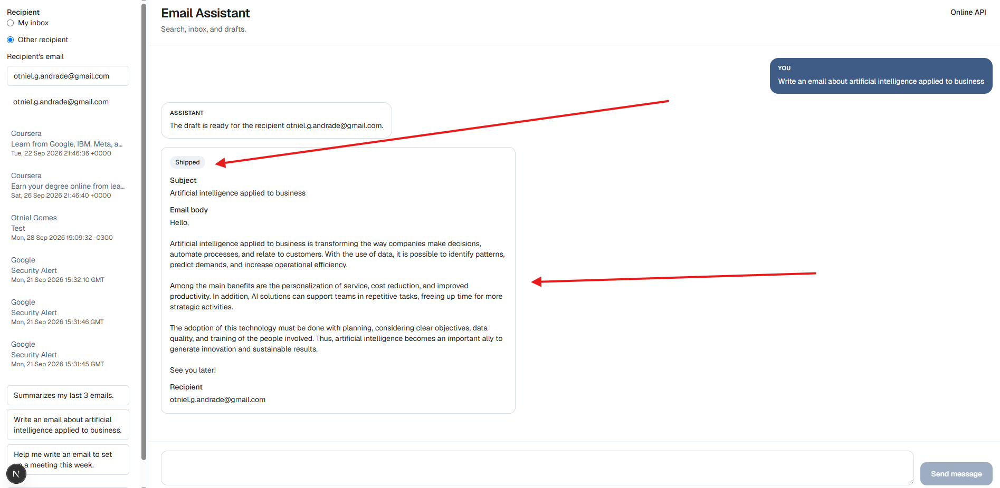

### Revise the draft

With the card open, ask in the composer: *Shorten the body and change the subject to "AI in business".* The same card updates. A second draft does not appear.

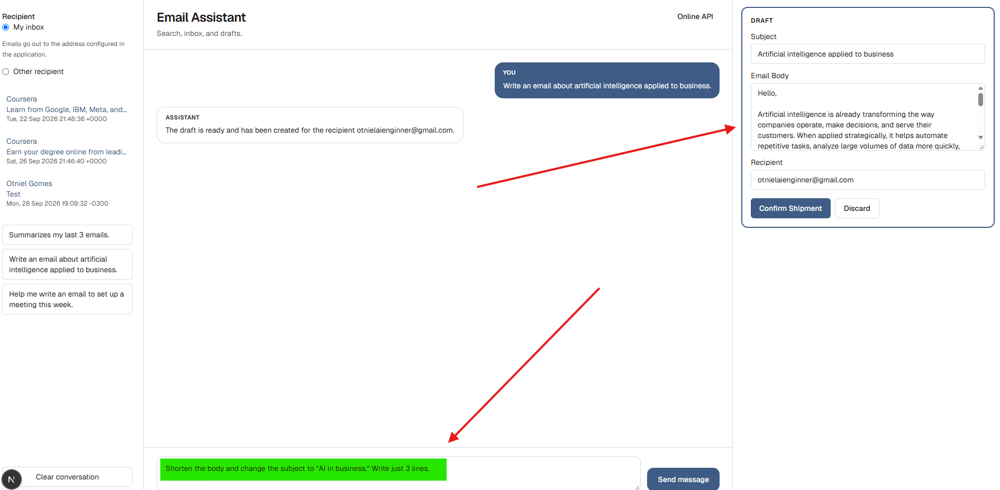

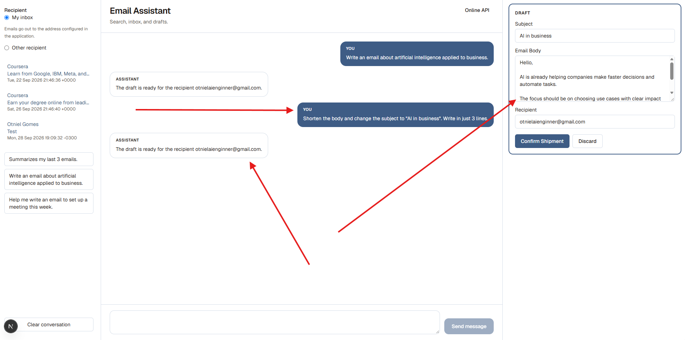

### Summarize the inbox

In a clear conversation, use *Summarize my last 3 emails.* The assistant answers with the sender and subject of the test messages.

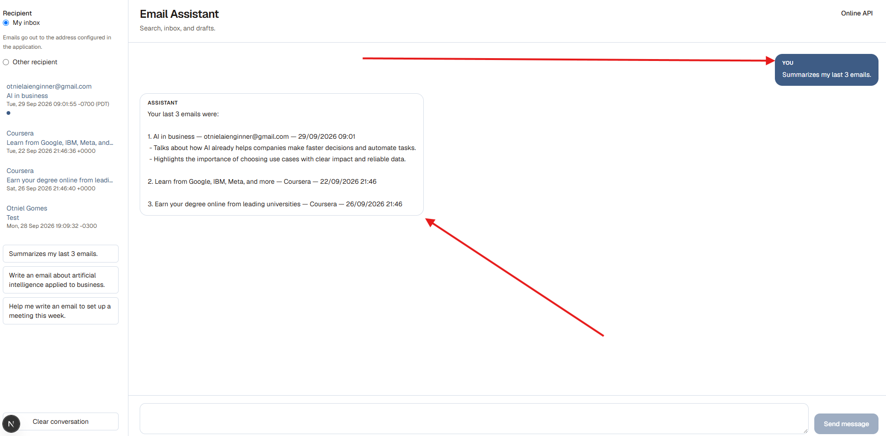

## Getting started

### Prerequisites

- [Docker](https://docs.docker.com/get-docker/) and Docker Compose
- A Gmail account with an [App Password](https://support.google.com/accounts/answer/185833) (2FA required)
- An [OpenAI](https://platform.openai.com/api-keys) API key

### Setup

1. Clone the repository:

```bash
git clone https://github.com/OtnielGomes/AI-Agent-with-Docker-Containers-and-Python.git
cd AI-Agent-with-Docker-Containers-and-Python
```

2. Copy the environment template:

```bash
cp .env.example .env
```

On PowerShell: `Copy-Item .env.example .env`

3. Fill `.env` with real values. Keep secrets out of git.

| Variable | Required | Description |
|----------|----------|-------------|
| `API_KEY` | Yes | Checked when the API starts |
| `DATABASE_URL` | Yes | PostgreSQL connection string |
| `OPENAI_API_KEY` | Yes | OpenAI API key |
| `OPENAI_MODEL_NAME` | No | Model name (for example `gpt-5-mini`) |
| `OPENAI_BASE_URL` | No | OpenAI-compatible endpoint |
| `EMAIL_ADDRESS` | Yes* | Gmail address used to send and read |
| `EMAIL_PASSWORD` | Yes* | Gmail App Password |
| `EMAIL_HOST` | No | Default `smtp.gmail.com` |
| `EMAIL_PORT` | No | Default `465` |
| `EMAIL_SENDER_NAME` | No | Display name on the sign-off |
| `BACKEND_URL` | No | API URL for the chat UI |
| `LANGSMITH_API_KEY` | No | LangSmith key for the local Experiment command |
| `LANGSMITH_PROJECT` | No | LangSmith project for that command (`email-assistant`). Does not turn on tracing for the API |

\* Required for inbox, drafts, and sending.

### Run with Docker Compose

```bash
docker compose up --build
```

| Service | Local URL |
|---------|-----------|
| Web (Next.js) | http://localhost:3000 |
| API (FastAPI) | http://localhost:8080 |
| PostgreSQL | localhost:5432 |

> [!TIP]
> A draft or a summary can take a couple of minutes. The chat UI waits up to 300 seconds. In production, give the reverse proxy at least that long.

### API without Docker

```bash
cd api/src
pip install -r ../requirements.txt
uvicorn main:app --host 0.0.0.0 --port 8000
```

Point `DATABASE_URL` at a running Postgres instance.

### Web UI against the API in Docker

```bash
docker compose up api db_service
cd web
npm install
BACKEND_URL=http://localhost:8080 npm run dev
```

## Checks

`scripts/check.sh` runs the API tests, the web lint, and a check that every local image cited in the READMEs exists under `images/`. GitHub Actions runs that script on every push and pull request.

To run it before each commit in this clone:

```bash
git config core.hooksPath scripts/hooks
```

Git then uses the tracked `scripts/hooks/pre-commit`, which calls `scripts/check.sh`. Install the API and web dependencies first. The script does not install them.

## API

| Method | Endpoint | Description |
|--------|----------|-------------|
| `GET` | `/` | Health check and project name |
| `GET` | `/api/chats/` | Chat router status |
| `GET` | `/api/chats/recent/` | Last 10 stored messages |
| `POST` | `/api/chats/` | Message to the supervisor. Returns `content` and `drafts` |
| `GET` | `/api/inbox/` | Recent inbox messages |
| `POST` | `/api/inbox/{email_id}/read` | Mark one message read |
| `POST` | `/api/inbox/{email_id}/reply` | Open a reply draft to that sender |
| `GET` | `/api/drafts/` | Open drafts |
| `POST` | `/api/drafts/{draft_id}/confirm` | Send that draft over SMTP |
| `POST` | `/api/drafts/{draft_id}/discard` | Discard that draft |

A summary comes back in `content`. A request to write mail comes back with the draft in `drafts`. SMTP runs on confirm, with the subject, body, and recipient on the card. Pass `to_email` on `POST /api/chats/` when the new draft should use a pinned recipient. A reply ignores that pin.

```powershell
Invoke-RestMethod -Method POST -Uri "http://localhost:8080/api/chats/" `
  -ContentType "application/json" `
  -Body '{"message": "Summarize my last 3 emails."}'
```

## Deploy

The app is deployed on **DigitalOcean App Platform** as one Web App with three components: the API (`api`), the interface (`web`), and managed PostgreSQL.


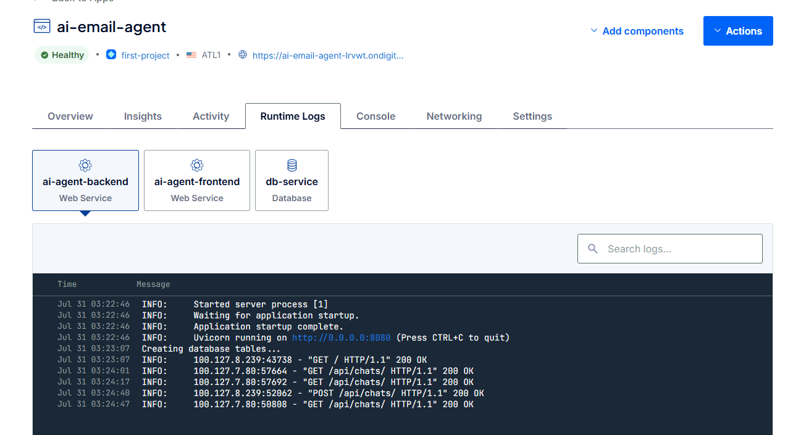

### Production checklist

- Set every variable from `.env.example` in the App Platform dashboard. Point `DATABASE_URL` at the managed database.
- API run command: `uvicorn main:app --host 0.0.0.0 --port 8000`.
- Web run command: `npm run start`.
- Some hosts block SMTP on ports 465 and 587. If send works locally and fails in production, test that port from the app or move sending to an HTTPS provider.

> [!IMPORTANT]
> `api/Dockerfile` starts `http.server`. Set the API run command to uvicorn, as `compose.yaml` does locally on port 8080. `web/Dockerfile` runs `npm run dev`, which fits Compose; production uses `npm run start`.

## Project structure

```
.
├── compose.yaml              # api, web, and Postgres
├── .env.example              # Environment template
├── images/                   # UI and deploy screenshots
├── web/                      # Next.js chat UI
└── api/
    ├── Dockerfile
    ├── requirements.txt
    └── src/
        ├── main.py           # FastAPI entrypoint
        └── api/
            ├── db.py         # SQLModel engine and session
            ├── drafts.py     # Draft store, confirm, discard
            ├── inbound_mail.py
            ├── inbox_routing.py
            ├── chat/         # Chat routes and message models
            ├── ai/           # Agents, tools, LLM, schemas
            └── myemailer/    # SMTP, IMAP, Gmail parser
```

## Troubleshooting

| Issue | What to check |
|-------|---------------|
| Send fails in production | SMTP blocked on 465/587; app logs; TCP reachability |
| `API_KEY is not set` | `API_KEY` missing from `.env` or the deploy dashboard |
| Chat UI times out | Long turns are expected; wait up to 5 minutes or raise the proxy timeout |
| Empty inbox | App Password, and IMAP enabled on the Gmail account |
| UI cannot reach the API | `BACKEND_URL`, and `GET /api/chats/` while the API is up |
| Confirm does nothing | The draft is still open; confirm is the call that runs SMTP |
