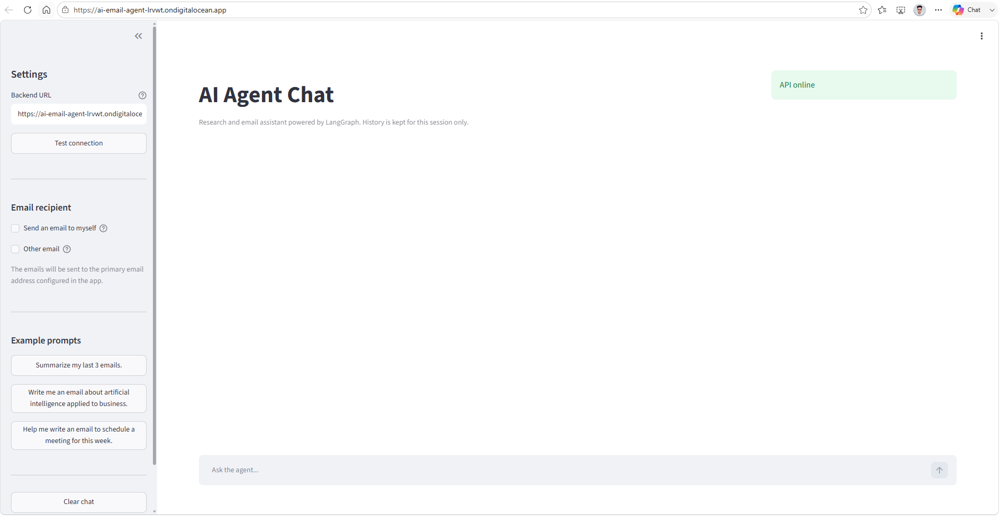
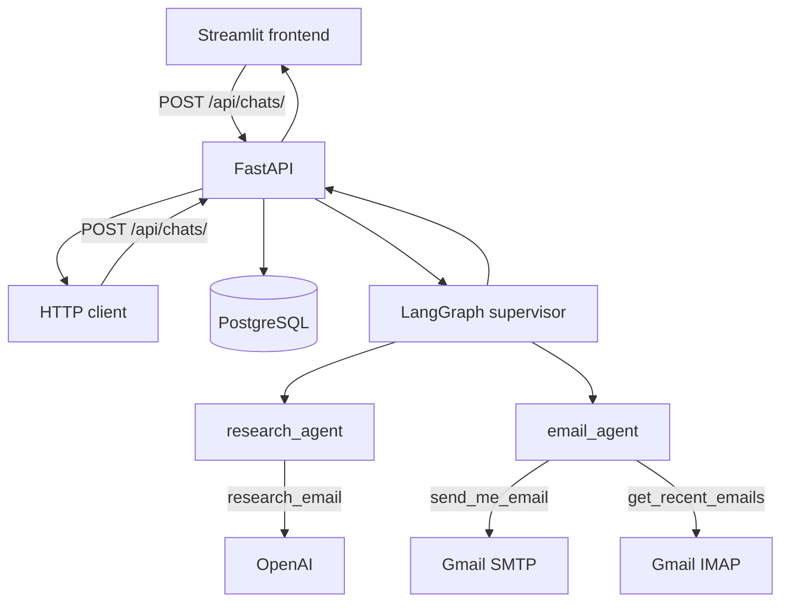
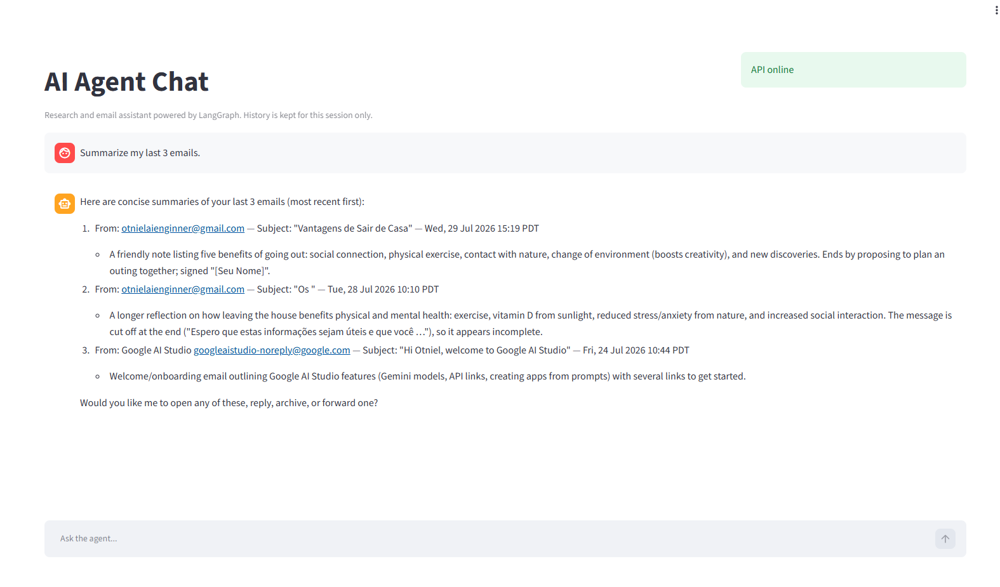
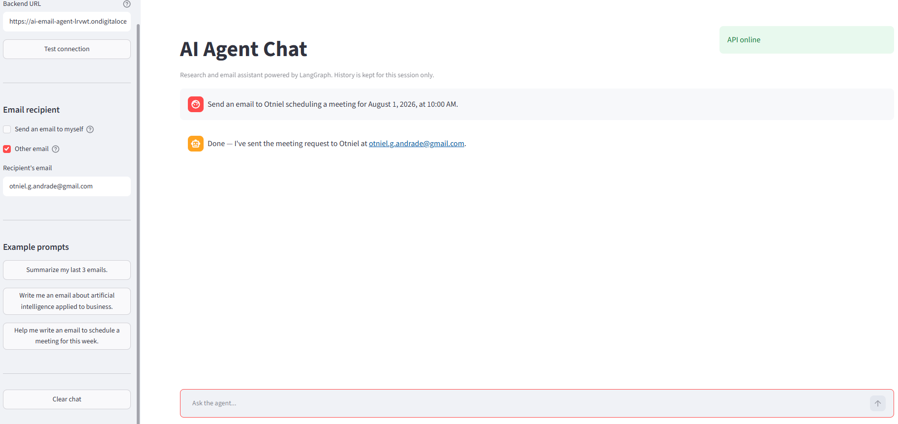
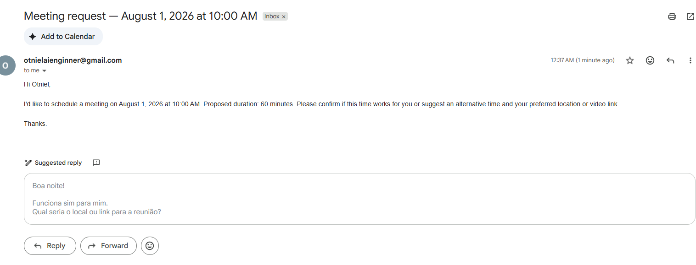
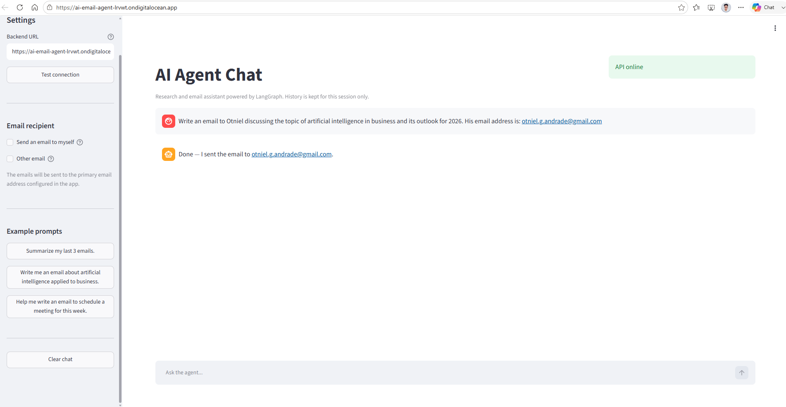
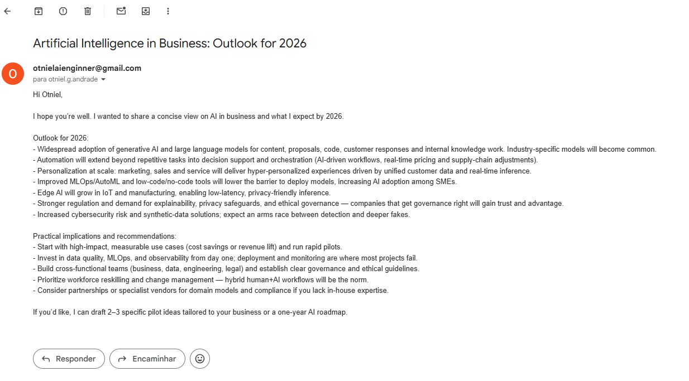
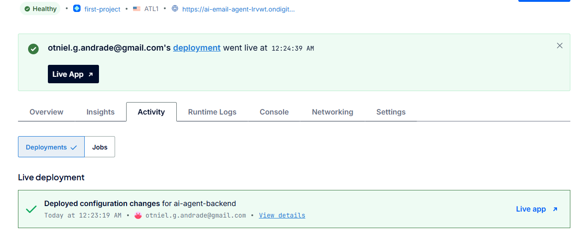
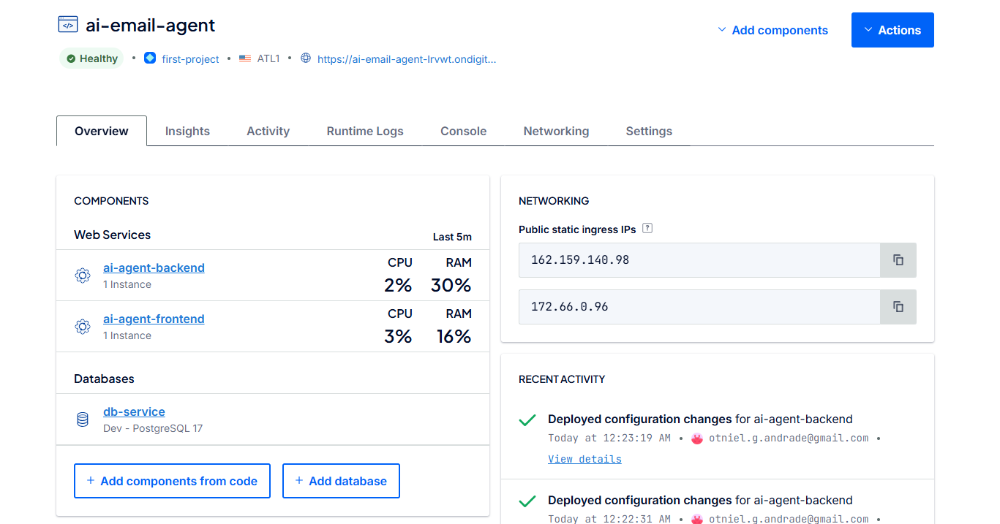

# AI Agent with Docker, LangGraph & Email

[](https://www.python.org/)
[](https://fastapi.tiangolo.com/)
[](https://langchain-ai.github.io/langgraph/)
[](https://streamlit.io/)
[](https://docs.docker.com/compose/)
[](https://www.postgresql.org/)

A **LangGraph multi-agent** chat assistant that researches content, reads your inbox, and sends emails via Gmail. **FastAPI** backend, **Streamlit** UI, and **PostgreSQL** persistence — all orchestrated with **Docker Compose** and ready to deploy on platforms like **DigitalOcean App Platform**.

[Overview](#overview) • [Features](#features) • [Architecture](#architecture) • [Demos](#demos) • [Getting started](#getting-started) • [API](#api) • [Deploy](#deploy) • [Project structure](#project-structure) • [Troubleshooting](#troubleshooting)



## Overview

This project exposes a chat API that delegates tasks to a **LangGraph supervisor**. The supervisor routes requests to specialized agents:

- **Research agent** — generates email subject and body from a natural-language request.
- **Email agent** — reads the inbox (IMAP), summarizes messages, and sends emails (SMTP).

Typical flow: *"Research AI applied to business and email me the results"* → the research agent produces the content → the email agent sends it to the configured recipient.

The Streamlit UI provides real-time chat, pre-built prompts, and the option to send to yourself or another address.

## Features

- **Multi-agent supervisor** — automatic routing between research and email with `langgraph-supervisor`.
- **Inbox reading** — listing, unread filtering, and summarization of recent emails via Gmail IMAP.
- **Email sending** — SMTP with Gmail App Password; recipient set in the UI or in the message.
- **Example prompts** — sidebar buttons to test summarization, drafting, and scheduling.
- **Persistence** — user messages saved to PostgreSQL via SQLModel.
- **Docker Compose** — backend, frontend, and database with hot-reload in development.
- **Production deploy** — tested on DigitalOcean App Platform (backend + frontend + managed Postgres).

## Architecture



| Layer | Technology | Responsibility |
|-------|------------|----------------|
| API | FastAPI, uvicorn | HTTP routes, validation, persistence |
| Agents | LangGraph, langgraph-supervisor | Supervisor + workers (research, email) |
| LLM | langchain-openai | Structured email generation |
| Email | smtplib, IMAP | Send and read via Gmail |
| Database | SQLModel, PostgreSQL | Chat message history |
| UI | Streamlit | Chat, recipient settings, prompts |
| Containers | Docker Compose | Local orchestration and production base |

## Demos

### Agent interface

Sidebar with connection test, recipient choice (*send to myself* or *other email*), and pre-built prompts.


### Summarize recent emails

Request: *"Summarize my last 3 emails."* — the agent reads the inbox and returns a structured summary.



### Schedule a meeting by email

Request: *"Help me write an email to schedule a meeting for this week."*

<table>
  <tr>
    <td width="50%"></td>
    <td width="50%"></td>
  </tr>
</table>

### Email about Artificial Intelligence

Request: *"Write me an email about artificial intelligence applied to business."*

<table>
  <tr>
    <td width="50%"></td>
    <td width="50%"></td>
  </tr>
</table>

## Getting started

### Prerequisites

- [Docker](https://docs.docker.com/get-docker/) and Docker Compose
- Gmail account with [App Password](https://support.google.com/accounts/answer/185833) enabled (2FA required)
- [OpenAI](https://platform.openai.com/api-keys) API key

### Setup

1. Clone the repository:

```bash
git clone https://github.com/<your-username>/AI-Agent-with-Docker-Containers-and-Python.git
cd AI-Agent-with-Docker-Containers-and-Python
```

2. Copy the environment template:

```bash
cp .env.sample .env
```

3. Edit `.env` with your real values (never commit secrets):

| Variable | Required | Description |
|----------|----------|-------------|
| `API_KEY` | Yes | Validated at backend startup |
| `DATABASE_URL` | Yes | PostgreSQL connection string |
| `OPENAI_API_KEY` | Yes | OpenAI API key |
| `OPENAI_MODEL_NAME` | No | Configurable default (e.g. `gpt-4o-mini`) |
| `OPENAI_BASE_URL` | No | Custom OpenAI-compatible endpoint |
| `EMAIL_ADDRESS` | Yes* | Gmail address (send + read) |
| `EMAIL_PASSWORD` | Yes* | Gmail App Password |
| `EMAIL_HOST` | No | Default `smtp.gmail.com` |
| `EMAIL_PORT` | No | Default `465` |
| `EMAIL_SENDER_NAME` | No | Display name when signing emails |
| `BACKEND_URL` | No | Backend URL for the frontend |

\* Required for email features.

### Run with Docker Compose

```bash
docker compose up --build
```

| Service | Local URL |
|---------|-----------|
| Frontend (Streamlit) | http://localhost:8501 |
| Backend (FastAPI) | http://localhost:8080 |
| PostgreSQL | localhost:5432 |

> [!TIP]
> Research + email flows can take **2+ minutes**. The frontend uses a 300 s timeout; configure reverse proxies with sufficient timeout in production.

### Backend development without Docker

```bash
cd backend/src
pip install -r ../requirements.txt
uvicorn main:app --host 0.0.0.0 --port 8000
```

Ensure `DATABASE_URL` points to a running Postgres instance.

### Local frontend (backend in Docker)

```bash
docker compose up backend db_service
cd frontend
pip install -r requirements.txt
BACKEND_URL=http://localhost:8080 streamlit run app.py
```

## API

| Method | Endpoint | Description |
|--------|----------|-------------|
| `GET` | `/` | Health check + project name |
| `GET` | `/api/chats/` | Chat router status |
| `GET` | `/api/chats/recent/` | Last 10 persisted messages |
| `POST` | `/api/chats/` | Send message → supervisor → response |

PowerShell example:

```powershell
Invoke-RestMethod -Method POST -Uri "http://localhost:8080/api/chats/" `
  -ContentType "application/json" `
  -Body '{"message": "Summarize my last 3 emails."}'
```

With an explicit recipient:

```powershell
Invoke-RestMethod -Method POST -Uri "http://localhost:8080/api/chats/" `
  -ContentType "application/json" `
  -Body '{"message": "Write an email about AI.", "to_email": "recipient@example.com"}'
```

## Deploy

The project was successfully deployed on **DigitalOcean App Platform** as a Web App with three components: API (backend), interface (Streamlit), and managed PostgreSQL.





### Manual build (backend)

```bash
docker build -t ai-agent-backend ./backend
docker run -p 8000:8000 --env-file .env ai-agent-backend \
  uvicorn main:app --host 0.0.0.0 --port 8000
```

### Production checklist

- Set all environment variables in your provider's dashboard.
- Point `DATABASE_URL` to managed Postgres.
- Start command: `uvicorn main:app --host 0.0.0.0 --port 8000` (backend) and `streamlit run app.py ...` (frontend).
- Some hosts block SMTP on ports 465/587 — if sending fails in production but works locally, test SMTP connectivity from the container or switch to an HTTPS email API (Resend, SendGrid, etc.).

> [!IMPORTANT]
> The default `CMD` in `backend/Dockerfile` is `http.server`; in production, **always** override it with uvicorn (as in `compose.yaml`).

## Project structure

```
.
├── compose.yaml              # Backend + frontend + Postgres
├── .env.sample               # Environment variable template (placeholders)
├── images/                   # Screenshots and demos
├── frontend/
│   ├── app.py                # Streamlit UI (chat, recipient, prompts)
│   ├── api_client.py         # HTTP client for the API
│   └── Dockerfile
└── backend/
    ├── Dockerfile
    ├── requirements.txt
    └── src/
        ├── main.py           # FastAPI entrypoint
        └── api/
            ├── db.py         # SQLModel engine and session
            ├── chat/         # Routes and message models
            ├── ai/           # Agents, tools, LLM, schemas
            └── myemailer/    # SMTP, IMAP, Gmail parser
```

## Troubleshooting

| Issue | What to check |
|-------|---------------|
| Email fails in production | SMTP blocked by host; container logs; TCP test on port 465 |
| `API_KEY is not set` | Missing `API_KEY` in `.env` or deploy dashboard |
| Frontend timeout | Long flows are normal; increase proxy timeout or wait up to 5 min |
| Empty inbox | Correct App Password; IMAP enabled on Gmail account |
| API connection error | Correct `BACKEND_URL`; backend online (`GET /api/chats/`) |

For architecture details and coding conventions, see [AGENTS.md](./AGENTS.md).
