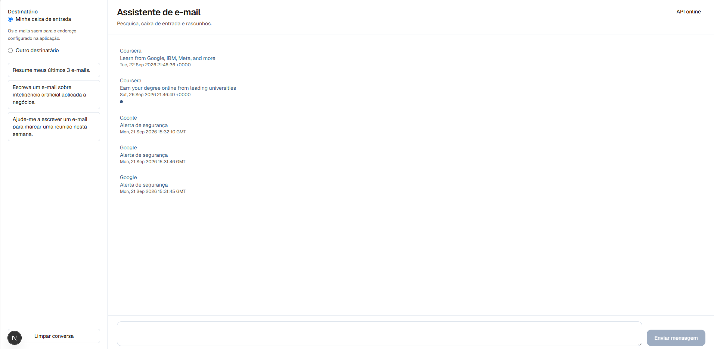
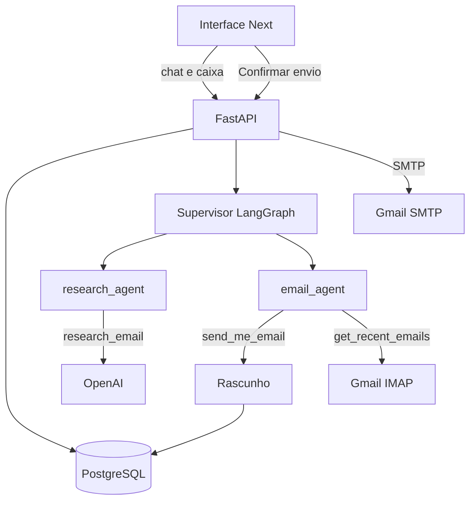
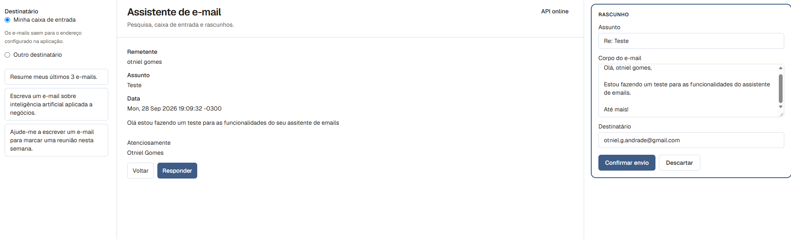
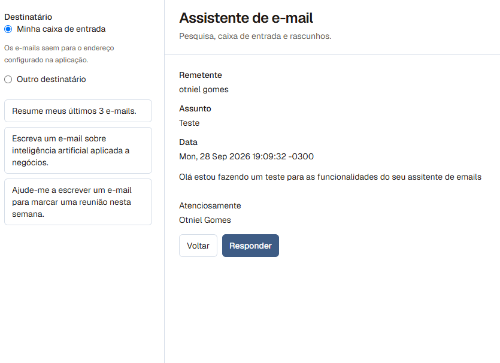
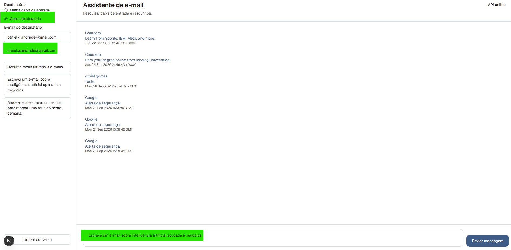
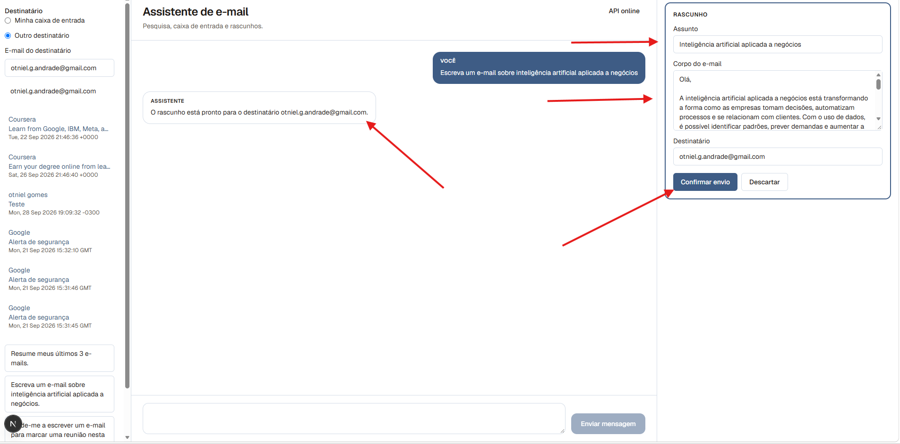
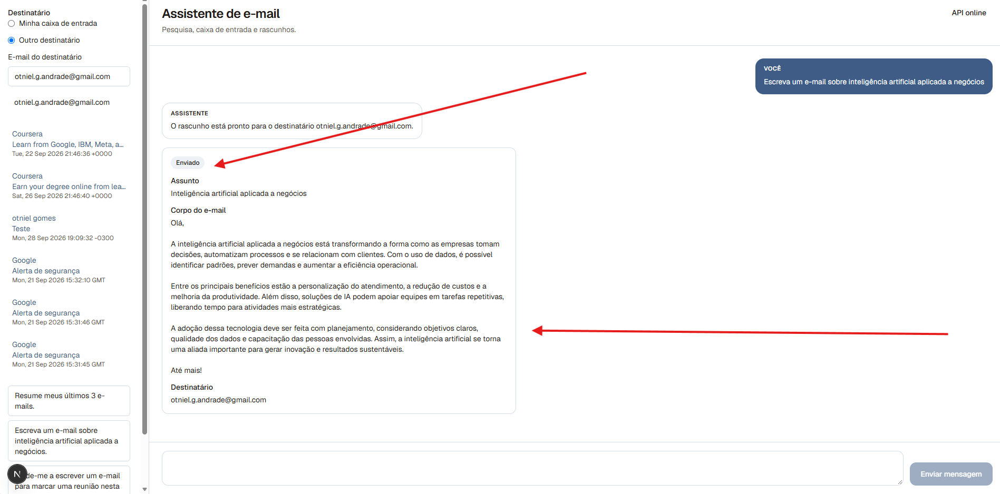
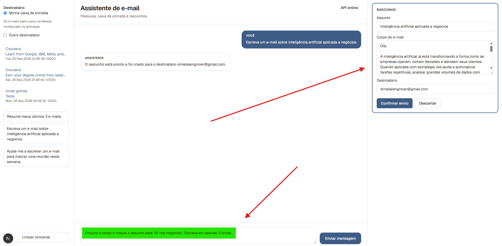
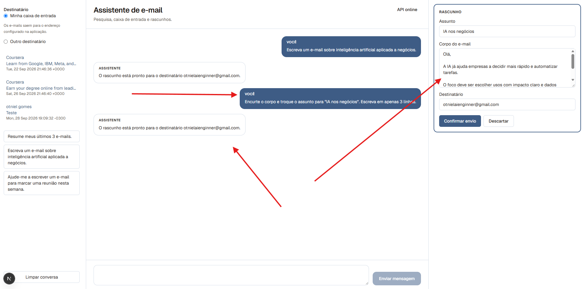
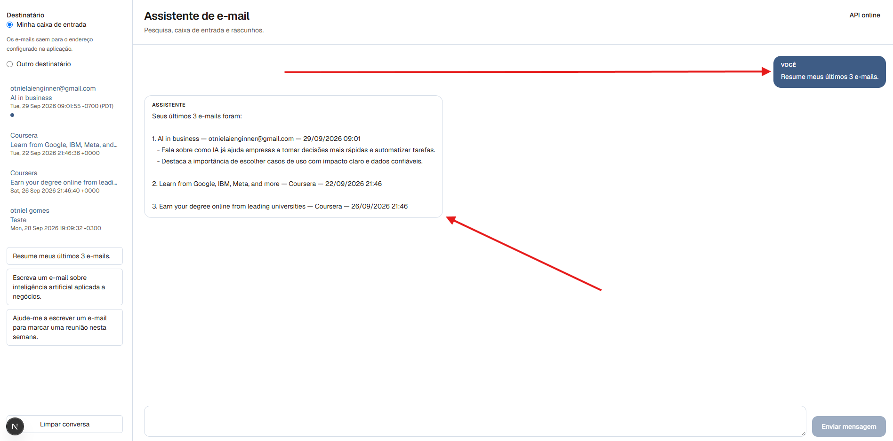

# Agente de e-mail com Docker, LangGraph e Python

[English](README.md) | [Português](README.pt-BR.md)

[](https://www.python.org/)
[](https://fastapi.tiangolo.com/)
[](https://langchain-ai.github.io/langgraph/)
[](https://nextjs.org/)
[](https://docs.docker.com/compose/)
[](https://www.postgresql.org/)

Um assistente de e-mail em **LangGraph**: lê a caixa de entrada, prepara o texto e só envia depois da confirmação. **FastAPI** (`api/`), interface de chat em **Next.js** (`web/`) e **PostgreSQL**, orquestrados com **Docker Compose** e publicados na **DigitalOcean App Platform**.

[Visão geral](#visão-geral) • [Recursos](#recursos) • [Arquitetura](#arquitetura) • [Passeio](#passeio) • [Como rodar](#como-rodar) • [API](#api) • [Deploy](#deploy) • [Estrutura do projeto](#estrutura-do-projeto) • [Problemas comuns](#problemas-comuns)



## Visão geral

A interface conversa com um **supervisor LangGraph**. O supervisor encaminha cada mensagem a um especialista:

- **Agente de pesquisa** — transforma o pedido em assunto e corpo em texto puro.
- **Agente de e-mail** — lê a caixa por IMAP, resume as mensagens e prepara o e-mail de saída.

O e-mail de saída nasce como **rascunho** num cartão de revisão. Dá para editar assunto, corpo e destinatário e então escolher **Confirmar envio** ou **Descartar**. O SMTP roda na confirmação.

Com a conversa vazia, a caixa fica no centro. A lateral fixa **Minha caixa de entrada** ou **Outro destinatário** e oferece três prompts de exemplo. Uma resposta ao e-mail aberto usa o remetente daquela mensagem. O endereço fixado na lateral vale para o próximo rascunho novo.

## Recursos

- **Supervisor multiagente** — encaminha pesquisa e e-mail com `langgraph-supervisor`.
- **Caixa de entrada** — mensagens recentes no centro; ao abrir, aparecem remetente, assunto, data e corpo em texto, e o ponto de não lido some.
- **Rascunho e depois envio** — o assistente monta o cartão; **Confirmar envio** entrega pelo SMTP do Gmail.
- **Resposta** — **Responder** abre um rascunho com assunto `Re:` e o remetente como destinatário.
- **Revisão no mesmo cartão** — um pedido no compositor atualiza aquele cartão.
- **Resumos** — e-mails recentes, com remetente e assunto, a partir do prompt de exemplo.
- **Persistência** — mensagens do chat no PostgreSQL, com SQLModel.
- **Docker Compose** — api, interface e banco, com recarga durante o desenvolvimento.
- **Deploy em produção** — DigitalOcean App Platform (api, interface e Postgres gerenciado).

## Arquitetura



| Camada | Tecnologia | Responsabilidade |
|--------|------------|------------------|
| API | FastAPI, uvicorn | HTTP, validação, persistência |
| Agentes | LangGraph, langgraph-supervisor | Supervisor, pesquisa e e-mail |
| LLM | langchain-openai | Assunto e corpo em texto puro |
| E-mail | smtplib, IMAP | Envio na confirmação, leitura via Gmail |
| Banco | SQLModel, PostgreSQL | Mensagens e rascunhos |
| Interface | Next.js | Caixa, chat, cartão de revisão, prompts |
| Contêineres | Docker Compose | Stack local e base de produção |

## Passeio

### Tela inicial

Abra a página sem conversa. A lista de e-mails fica no centro. Na lateral, **Minha caixa de entrada** e os três prompts de exemplo. Essa tela é a capa acima.

### E-mail aberto

Clique em um item não lido (o ponto azul). A tela mostra remetente, assunto, data e corpo em texto, com **Voltar** e **Responder**. O ponto some depois que o corpo abre.



### Resposta

Clique em **Responder**. O cartão **Rascunho** abre com assunto `Re: …`, saudação e o remetente como destinatário. O destinatário fixado na lateral fica de fora dessa resposta.



### Rascunho a partir do chat

Descarte o rascunho anterior ou limpe a conversa. Use o prompt *Escreva um e-mail sobre inteligência artificial aplicada a negócios.* O cartão volta com assunto, corpo que abre com `Olá,` e fecha com `Até mais!`, e os botões **Confirmar envio** e **Descartar**.





**Confirmar envio** entrega esse cartão. A mesma conversa passa a mostrá-lo como enviado.



### Revisão

Com o cartão aberto, peça no compositor: *Encurte o corpo e troque o assunto para "IA nos negócios".* O mesmo cartão é atualizado. Um segundo rascunho não aparece.





### Resumo da caixa

Em uma conversa limpa, use *Resume meus últimos 3 e-mails.* A resposta do assistente traz remetente e assunto dos e-mails de teste.



## Como rodar

### Pré-requisitos

- [Docker](https://docs.docker.com/get-docker/) e Docker Compose
- Conta Gmail com [senha de app](https://support.google.com/accounts/answer/185833) (a verificação em duas etapas precisa estar ativa)
- Chave de API da [OpenAI](https://platform.openai.com/api-keys)

### Preparação

1. Clone o repositório:

```bash
git clone https://github.com/OtnielGomes/AI-Agent-with-Docker-Containers-and-Python.git
cd AI-Agent-with-Docker-Containers-and-Python
```

2. Copie o modelo de ambiente:

```bash
cp .env.example .env
```

No PowerShell: `Copy-Item .env.example .env`

3. Preencha o `.env` com valores reais. Segredos ficam fora do git.

| Variável | Obrigatória | Descrição |
|----------|-------------|-----------|
| `API_KEY` | Sim | Conferida na subida da API |
| `DATABASE_URL` | Sim | String de conexão do PostgreSQL |
| `OPENAI_API_KEY` | Sim | Chave da API OpenAI |
| `OPENAI_MODEL_NAME` | Não | Nome do modelo (por exemplo `gpt-5-mini`) |
| `OPENAI_BASE_URL` | Não | Endpoint compatível com a API OpenAI |
| `EMAIL_ADDRESS` | Sim* | Endereço Gmail usado para enviar e ler |
| `EMAIL_PASSWORD` | Sim* | Senha de app do Gmail |
| `EMAIL_HOST` | Não | Padrão `smtp.gmail.com` |
| `EMAIL_PORT` | Não | Padrão `465` |
| `EMAIL_SENDER_NAME` | Não | Nome exibido na assinatura |
| `BACKEND_URL` | Não | URL da API para a interface |
| `LANGSMITH_API_KEY` | Não | Chave do LangSmith para o comando local do Experimento |
| `LANGSMITH_PROJECT` | Não | Projeto LangSmith desse comando (`email-assistant`). Não liga o rastreio da API |

\* Obrigatórias para caixa, rascunho e envio.

### Rodar com Docker Compose

```bash
docker compose up --build
```

| Serviço | URL local |
|---------|-----------|
| Interface (Next.js) | http://localhost:3000 |
| API (FastAPI) | http://localhost:8080 |
| PostgreSQL | localhost:5432 |

> [!TIP]
> Um rascunho ou um resumo pode levar alguns minutos. A interface espera até 300 segundos. Em produção, deixe o proxy reverso com pelo menos esse tempo.

### API sem Docker

```bash
cd api/src
pip install -r ../requirements.txt
uvicorn main:app --host 0.0.0.0 --port 8000
```

Aponte `DATABASE_URL` para um Postgres em execução.

### Interface contra a API no Docker

```bash
docker compose up api db_service
cd web
npm install
BACKEND_URL=http://localhost:8080 npm run dev
```

## API

| Método | Endpoint | Descrição |
|--------|----------|-----------|
| `GET` | `/` | Saúde da API e nome do projeto |
| `GET` | `/api/chats/` | Status do roteador de chat |
| `GET` | `/api/chats/recent/` | Últimas 10 mensagens gravadas |
| `POST` | `/api/chats/` | Mensagem ao supervisor. Devolve `content` e `drafts` |
| `GET` | `/api/inbox/` | Mensagens recentes da caixa |
| `POST` | `/api/inbox/{email_id}/read` | Marca uma mensagem como lida |
| `POST` | `/api/inbox/{email_id}/reply` | Abre um rascunho de resposta para aquele remetente |
| `GET` | `/api/drafts/` | Rascunhos abertos |
| `POST` | `/api/drafts/{draft_id}/confirm` | Envia aquele rascunho por SMTP |
| `POST` | `/api/drafts/{draft_id}/discard` | Descarta aquele rascunho |

Um resumo volta em `content`. Um pedido para escrever e-mail volta com o rascunho em `drafts`. O SMTP roda na confirmação, com o assunto, o corpo e o destinatário que estão no cartão. Envie `to_email` no `POST /api/chats/` quando o rascunho novo deve usar um destinatário fixado. Uma resposta ignora esse fixo.

```powershell
Invoke-RestMethod -Method POST -Uri "http://localhost:8080/api/chats/" `
  -ContentType "application/json" `
  -Body '{"message": "Resume meus últimos 3 e-mails."}'
```

## Deploy

O aplicativo está publicado na **DigitalOcean App Platform** como um Web App com três componentes: a API (`api`), a interface (`web`) e um PostgreSQL gerenciado.


### Checklist de produção

- Defina cada variável do `.env.example` no painel da App Platform. Aponte `DATABASE_URL` para o banco gerenciado.
- Comando da API: `uvicorn main:app --host 0.0.0.0 --port 8000`.
- Comando da interface: `npm run start`.
- Alguns provedores bloqueiam SMTP nas portas 465 e 587. Se o envio funciona na máquina e falha em produção, teste essa porta a partir do app ou passe o envio para um provedor HTTPS.

> [!IMPORTANT]
> O `api/Dockerfile` sobe `http.server`. Defina o comando da API como uvicorn, como o `compose.yaml` faz localmente na porta 8080. O `web/Dockerfile` roda `npm run dev`, adequado ao Compose; em produção use `npm run start`.

## Estrutura do projeto

```
.
├── compose.yaml              # api, interface e Postgres
├── .env.example              # Modelo de variáveis
├── images/                   # Capturas da interface e do deploy
├── web/                      # Interface de chat em Next.js
└── api/
    ├── Dockerfile
    ├── requirements.txt
    └── src/
        ├── main.py           # Entrada do FastAPI
        └── api/
            ├── db.py         # Engine e sessão SQLModel
            ├── drafts.py     # Rascunhos, confirmação e descarte
            ├── inbound_mail.py
            ├── inbox_routing.py
            ├── chat/         # Rotas do chat e modelos de mensagem
            ├── ai/           # Agentes, ferramentas, LLM e schemas
            └── myemailer/    # SMTP, IMAP e parser do Gmail
```

## Problemas comuns

| Situação | O que conferir |
|----------|----------------|
| O envio falha em produção | SMTP bloqueado em 465/587; logs do app; alcance TCP |
| `API_KEY is not set` | `API_KEY` ausente no `.env` ou no painel do deploy |
| A interface estoura o tempo | Turnos longos são esperados; espere até 5 minutos ou aumente o timeout do proxy |
| Caixa vazia | Senha de app e IMAP ativo na conta Gmail |
| A interface não alcança a API | `BACKEND_URL` e `GET /api/chats/` com a API no ar |
| Confirmar não envia | O rascunho continua aberto; a confirmação é a chamada que dispara o SMTP |
